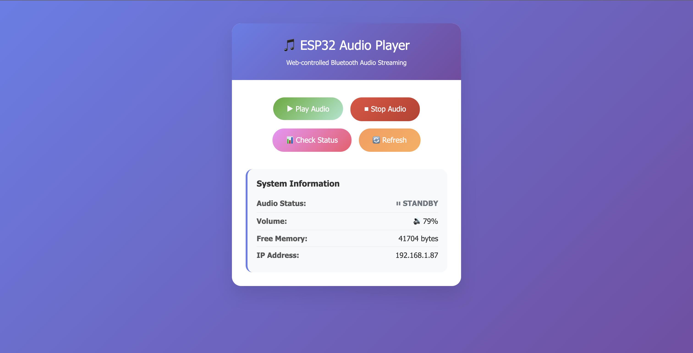

# ESP32 Bluetooth Speaker Sender

🎵 **ESP32-based Bluetooth A2DP Source with Web API Control**




ESP32 Bluetooth audio transmitter that can be controlled via Web API, streaming WAV audio files from SPIFFS file system to Bluetooth speakers.


## ✨ Features

- 🎧 **Bluetooth A2DP Source** - Stream audio to Bluetooth speakers/headphones
- 🌐 **Web API Control** - Control audio playback via HTTP API
- 📁 **SPIFFS File System** - Store audio files in Flash memory
- 🔄 **Smart Playback** - Play once and stop automatically
- 📊 **Real-time Status** - Monitor system status in real-time
- 🎛️ **Volume Control** - Adjustable volume levels
- 💾 **Memory Optimized** - Uses streaming instead of loading entire file

## 🛠️ Hardware Requirements

- **ESP32 Development Board** (NodeMCU-32S or compatible)
- **WiFi Network** for Web API access
- **Bluetooth Speaker/Headphones** with A2DP support
- **MicroSD Card** (optional for larger audio files)

## 📋 Audio File Requirements

- **Format**: WAV (PCM)
- **Sample Rate**: 44.1 kHz
- **Channels**: Stereo (2 channels)
- **Bit Depth**: 16-bit
- **Size**: ≤ 2MB (depends on SPIFFS partition)

## 🚀 Installation

### 1. Clone Repository
```bash
git clone https://github.com/toygame/ESP32-Bluetooth-Speaker-Sender.git
cd ESP32-Bluetooth-Speaker-Sender
```

### 2. Install PlatformIO
```bash
# Install PlatformIO CLI
pip install platformio

# Or use VS Code Extension
# Search for "PlatformIO IDE" in VS Code Extensions
```

### 3. Configure Settings
Edit `src/main.cpp` in the setup() function:
```cpp
// WiFi Configuration
controller.setWiFiCredentials("YOUR_WIFI_SSID", "YOUR_WIFI_PASSWORD");

// Bluetooth Device Name
controller.setBluetoothDeviceName("AL-01");

// Audio File Path
controller.setAudioFile("/play1.wav");

// Status Update Interval (milliseconds)
controller.setStatusUpdateInterval(10000); // 10 seconds

// Initial Volume (0-100%)
controller.setVolume(80);
```

### 4. Prepare Audio File
1. Place `play1.wav` file in `data/` folder
2. Ensure file meets the requirements above

### 5. Build & Upload
```bash
# Clean and build
pio run --target clean
pio run

# Upload filesystem (audio files)
pio run --target uploadfs

# Upload firmware
pio run --target upload

# Monitor serial output
pio device monitor
```

## 🎮 Usage

### Getting Started

1. **Power On**: Turn on ESP32 device
2. **WiFi Connection**: Wait for WiFi connection
3. **Bluetooth Pairing**: Pair Bluetooth speaker with "AL-01"
4. **Get IP Address**: Check IP address in Serial Monitor

### Web Interface

Open browser and navigate to: `http://[ESP32_IP_ADDRESS]/`

```
ESP32 Audio Player
- Play Audio
- Check Status
```

## 🔗 API Endpoints

### GET `/`
**Main Web Interface**
```
Response: HTML page with controls
```

### GET `/play1`
**Play audio once**
```bash
curl http://192.168.1.100/play1
```
```
Response: "Audio playback started!" (200)
         "Audio already playing - request skipped" (409)
         "Failed to start..." (500)
```

### GET `/stop`
**Stop audio playback**
```bash
curl http://192.168.1.100/stop
```
```
Response: "Audio playback stopped!" (200)
         "Audio not playing - nothing to stop" (409)
```

### GET `/volume`
**Get current volume (0-100)**
```bash
curl http://192.168.1.100/volume
```
```
Response: {"volume":80,"range":"0-100"}
```

### POST `/volume`
**Set volume (0-100)**
```bash
curl -X POST http://192.168.1.100/volume -d "volume=75"
```
```
Response: {"status":"success","volume":75}
         {"error":"Volume must be 0-100"} (400)
```

### GET `/status`
**Check system status**
```bash
curl http://192.168.1.100/status
```
```
Response:
Status: STANDBY
Free Heap: 234567 bytes
WiFi IP: 192.168.1.100
```

## 📊 System States

| State | Description | Audio Output |
|-------|-------------|--------------|
| **STANDBY** | Waiting for commands | Silent |
| **PLAYING** | Playing audio | PCM audio data |

### State Transitions
```
STANDBY --[API /play1]--> PLAYING --[Complete 1 cycle]--> STANDBY
                             |
                        [API /stop]
                             |
                             v
                         STANDBY
```

### Flow Control
- **Duplicate Play Requests**: If `/play1` is called while `PLAYING`, returns HTTP 409 (skipped)
- **Redundant Stop Requests**: If `/stop` is called while `STANDBY`, returns HTTP 409 (ignored)
- **Volume Mapping**: API uses 0-100 scale, internally converts to Bluetooth 0-127 range

## 🔧 Configuration

### Partition Table (`audio_partitions.csv`)
```csv
# Name,   Type, SubType, Offset,  Size,     Flags
nvs,      data, nvs,     0x9000,  0x5000,
otadata,  data, ota,     0xe000,  0x2000,
app0,     app,  ota_0,   0x10000, 0x1E0000,
spiffs,   data, spiffs,  0x1F0000,0x200000,
```

### Build Flags (`platformio.ini`)
```ini
build_flags =
    -Os                                    # Optimize for size
    -D CORE_DEBUG_LEVEL=5                  # Debug level
    -D CONFIG_ASYNC_TCP_MAX_ACK_TIME=5000  # TCP timeout
    -D CONFIG_ASYNC_TCP_RUNNING_CORE=1     # CPU core binding
    -D CONFIG_ASYNC_TCP_STACK_SIZE=4096    # Stack size
    -ffunction-sections                    # Linker optimization
    -fdata-sections
    -Wl,--gc-sections
    -Wl,--strip-all
```

## 🎵 Audio Processing Flow

```
WAV File (SPIFFS) → Parse Header → Extract PCM Data → 
Bluetooth A2DP → Codec (SBC) → Bluetooth Speaker
```

1. **File Reading**: Real-time streaming from SPIFFS
2. **Header Parsing**: Analyze WAV header to find PCM data
3. **Frame Processing**: Convert PCM to frames for A2DP
4. **Bluetooth Transmission**: Send via SBC codec

## 🐛 Troubleshooting

### Common Issues

#### 1. **Cannot connect to WiFi**
```
Solution: Check SSID and password in src/main.cpp
```

#### 2. **SPIFFS Mount Failed**
```bash
# Re-upload filesystem
pio run --target uploadfs
```

#### 3. **Audio file not found**
```
Solution: 
1. Place play1.wav file in data/ folder
2. Run pio run --target uploadfs
```

#### 4. **Bluetooth pairing failed**
```
Solution:
1. Remove "AL-01" device from speaker
2. Reset ESP32
3. Pair again
```

#### 5. **Firmware too large**
```
Error: The program size (1612389 bytes) is greater than maximum allowed

Solution: Use partition table with larger app size (audio_partitions.csv)
```

#### 6. **No sound output**
```
Checklist:
✓ Audio file is 44.1kHz, 16-bit, stereo PCM
✓ Bluetooth speaker paired and connected
✓ Call API /play1 to start playback
✓ Check volume level via /volume API
```

#### 7. **API returns "Audio already playing"**
```
Error: HTTP 409 - Audio already playing - request skipped

This is normal behavior:
- System prevents overlapping playback
- Wait for current audio to finish, or
- Use /stop API to stop current playback
```

#### 8. **Volume control not working**
```
Solutions:
1. Check if Bluetooth speaker supports A2DP volume control
2. Use /volume API with values 0-100
3. Some speakers ignore remote volume commands
```

#### 9. **Watchdog timeout errors**
```
Error: Task watchdog got triggered - async_tcp

Solutions applied:
✓ Auto-refresh disabled on web interface
✓ Watchdog reset added to main loop
✓ Memory monitoring for low-heap protection
```

### Debug Commands

```bash
# Real-time log monitoring
pio device monitor

# Check firmware size
pio run --target size

# View partition table
esptool.py --port /dev/ttyUSB0 read_flash 0x8000 0x1000 partition_table.bin
```

## 📁 Project Structure

```
ESP32-Bluetooth-Speaker-Sender/
├── src/                     # Source files
│   ├── main.cpp            # Main application entry point
│   ├── AudioPlayer.cpp     # Audio file handling and streaming
│   ├── BluetoothAudioSource.cpp # Bluetooth A2DP source management
│   ├── WebServerManager.cpp # Web server and API endpoints
│   ├── WiFiManager.cpp     # WiFi connection management
│   └── AudioPlayerController.cpp # Main system controller
├── include/                 # Header files
│   ├── AudioPlayer.h       # AudioPlayer class definition
│   ├── BluetoothAudioSource.h # Bluetooth source class definition
│   ├── WebServerManager.h  # Web server class definition
│   ├── WiFiManager.h       # WiFi manager class definition
│   └── AudioPlayerController.h # Main controller class definition
├── data/
│   └── play1.wav          # Audio file (add your own)
├── lib/
│   └── README             # Library directory
├── audio_partitions.csv   # Custom partition table
├── platformio.ini         # PlatformIO configuration
└── README.md             # This file
```

## 🔬 Technical Details

### Memory Usage
- **Flash**: ~1.6MB (firmware) + 2MB (SPIFFS)
- **RAM**: ~58KB (runtime)
- **Audio Buffer**: 4 bytes per frame (streaming)

### Bluetooth Specifications
- **Profile**: A2DP (Advanced Audio Distribution Profile)
- **Codec**: SBC (Sub-band Coding)
- **Sample Rate**: 44.1 kHz
- **Bit Rate**: ~320 kbps

### Network Stack
- **WiFi**: 802.11 b/g/n
- **HTTP Server**: ESPAsyncWebServer
- **TCP**: AsyncTCP with custom configuration

### Software Architecture (OOP Design)

The project uses **Object-Oriented Programming** with clear separation of concerns:

#### Class Structure

| Class | Responsibility | Key Methods |
|-------|---------------|-------------|
| `AudioPlayer` | WAV file parsing, PCM streaming | `prepareAudioFile()`, `startPlayback()`, `getAudioData()` |
| `BluetoothAudioSource` | A2DP Bluetooth management | `begin()`, `setVolume()`, `isConnected()` |
| `WiFiManager` | WiFi connection handling | `connect()`, `isConnected()`, `getLocalIP()` |
| `WebServerManager` | HTTP server and API endpoints | `setupRoutes()`, `handlePlayRequest()` |
| `AudioPlayerController` | Main system coordinator | `begin()`, `update()`, `printSystemStatus()` |

#### Design Patterns Used

- **Singleton Pattern**: BluetoothAudioSource uses static instance for callback handling
- **Observer Pattern**: Status updates and event handling across components
- **Strategy Pattern**: Modular component design allows easy swapping of implementations
- **Facade Pattern**: AudioPlayerController provides simple interface to complex subsystems

#### Dependencies Graph

```
AudioPlayerController
├── AudioPlayer (manages WAV files)
├── BluetoothAudioSource (uses AudioPlayer for data)
├── WiFiManager (provides network connectivity)
└── WebServerManager (uses AudioPlayer + WiFiManager)
```

## 📚 Dependencies

```ini
lib_deps =
    https://github.com/pschatzmann/ESP32-A2DP.git
    https://github.com/pschatzmann/arduino-audio-tools.git
    FS
    ESP32Async/AsyncTCP
    ESP32Async/ESPAsyncWebServer
```

## 🤝 Contributing

1. Fork the [repository](https://github.com/toygame/ESP32-Bluetooth-Speaker-Sender)
2. Create feature branch (`git checkout -b feature/AmazingFeature`)
3. Commit changes (`git commit -m 'Add AmazingFeature'`)
4. Push to branch (`git push origin feature/AmazingFeature`)
5. Open Pull Request

## 📄 License

This project is licensed under the MIT License - see the [LICENSE](LICENSE) file for details.

## 🙏 Acknowledgments

- [ESP32-A2DP](https://github.com/pschatzmann/ESP32-A2DP) by Phil Schatzmann
- [ESPAsyncWebServer](https://github.com/ESP32Async/ESPAsyncWebServer) by ESP32Async
- [Arduino Audio Tools](https://github.com/pschatzmann/arduino-audio-tools) by Phil Schatzmann

## 📞 Support

If you have any issues or questions:
- 🐛 [Create an Issue](https://github.com/toygame/ESP32-Bluetooth-Speaker-Sender/issues)
- 💬 [Discussions](https://github.com/toygame/ESP32-Bluetooth-Speaker-Sender/discussions)
- 📧 Email: thanapon.toy@hotmail.com

---

⭐ **If this project helps you, please give it a star!** ⭐ 